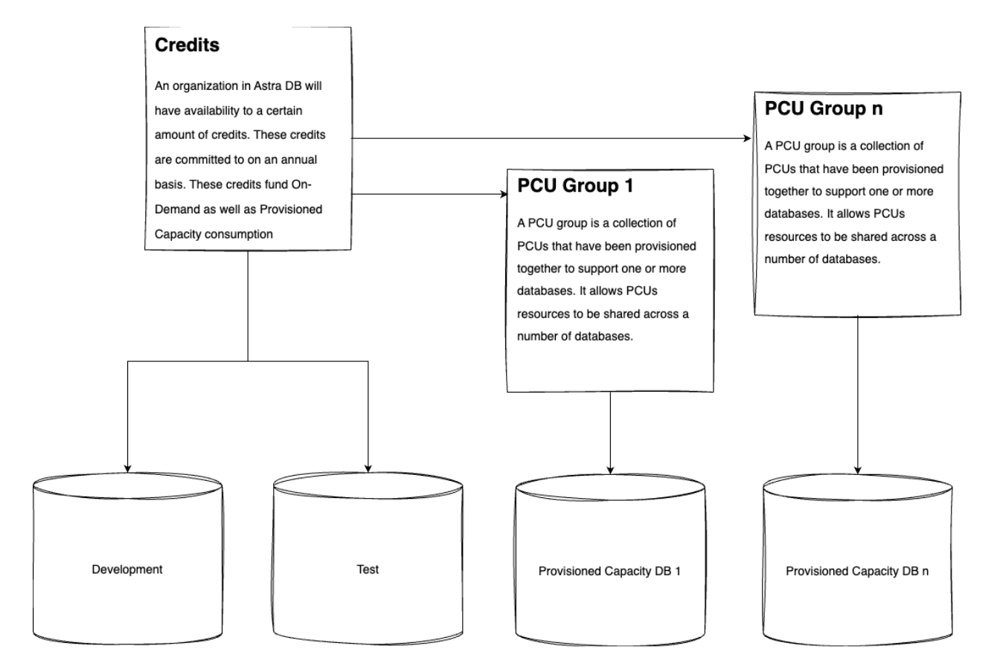

# Modern Data Infrastructure with Astra DB through IaC

## Scaling done easy

The scripts below enable easy scaling of the Astra DB through the [DevOps API](https://docs.datastax.com/en/astra-db-serverless/api-reference/devops-api.html).

[Provisioned Capacity Units (PCUs)](https://docs.datastax.com/en/astra-db-serverless/administration/provisioned-capacity-units.html) are pre-provisioned capacity for Astra DB Serverless databases to support complex, latency-sensitive workloads and accommodate periodic traffic spikes:

Compared to standard, on-demand capacity, PCUs provide the following benefits:
- **Continuous availability**: Where on-demand capacity relies on autoscaling in response to demand, PCUs are always available for your workloads. You can reserve minimum required resources that never scale down even when your databases are idle.
- **Predictable costs**: Hourly billing based on pre-determined rates means that you can pay a predictable amount each month.
- **Preparation for volatility**: In anticipation of daily spikes and seasonal traffic, you can reserve resources required to handle peak demand and ensure consistent performance.
- **Support for complex and sensitive workloads**: You can reserve resources required for consistent performance in complex and latency-sensitive workflows.

PCU groups are funded by Astra credits as follows:



## DevOps REST calls

Prepare your CLI by defining the ASTRA API Token as such:
```bash
export ASTRA_API_TOKEN="your-api-token-here"
```

### Retrieve existing PCU groups
```bash
curl -sS -L -X POST "https://api.astra.datastax.com/v2/pcus/actions/get" \
--header "Authorization: Bearer $ASTRA_API_TOKEN" \
--header "Content-Type: application/json" \
--data '{}'
```

### Create a new PCU group
The following REST call will create a new PCU group. One or more databases can later be added to this PCU group and will share the allocated capacity.

You'll need to gather the following outputs from the Terraform IaC:
- database_organization_id
- database_cloud_provider
- database_regions (select one first)

Furthermore the following characteristics can be defined now:
- **provisionType**: Set to shared for shared tenancy, or set to dedicated for dedicated tenancy
- **reserved**: Set the amount of reserved capacity for the group. This must be 1 or more for actual reserved capacity funded by RCUs or 0 for flexible PCUs funded by HCUs.
- **min**: The minimum number of PCUs that you want available at all times for this group. This must be equal to or greater than the reserved capacity.
- **max**: The maximum number of PCUs that this group can scale up to as needed. To disable autoscaling, set the maximum equal to the minimum.
- **instanceType**: Set to standard for standard cache storage, or set to storageOptimized to enable cache optimized storage.

```bash
curl -sS -L -X POST "https://api.astra.datastax.com/v2/pcus" \
--header "Authorization: Bearer $ASTRA_API_TOKEN" \
--header "Content-Type: application/json" \
--data '{
  "title": "My PCU Group",
  "description": "My PCU Group",
  "orgId": "ORGANIZATION_ID",
  "cloudProvider": [ "AWS" ],
  "region": "us-east-1",
  "provisionType": "shared",
  "reserved": 1,
  "min": 1,
  "max": 2,
  "instanceType": "standard"
}'
```

Upon creation, a PCU group has no databases associated with it. You need the `uuid` to add databases to the group, so please make note of that from the response.

### Add the previously created DB to the PCU group
The following REST call will add your database to the previously created PCU group.

You'll need to gather the following outputs from the Terraform IaC:
- database_id

With that we can retrieve the `datacenter id` by replacing `DB_ID` with the database_id from Terraform:
```bash
curl -sS -L -X GET "https://api.astra.datastax.com/v2/databases/DB_ID/datacenters" \
--header "Authorization: Bearer $ASTRA_API_TOKEN" \
--header "Accept: application/json"
```

The resulting JSON structure provides the `datacenter id` under field `id`, you can also pipe the result into `jq` by adding: `| jq '.[].id'`.

Now we can add the database to the PCU group. The following settings are required:
- **PCU_GROUP_ID**: The previously created PCU group ID.
- **DATACENTER_ID**: The previsouly retrieved `datacenter id` for the database.

```bash
curl -sS -L -X POST "https://api.astra.datastax.com/v2/pcus/association/PCU_GROUP_ID/DATACENTER_ID" \
--header "Authorization: Bearer $ASTRA_API_TOKEN" \
--header "Content-Type: application/json"
```