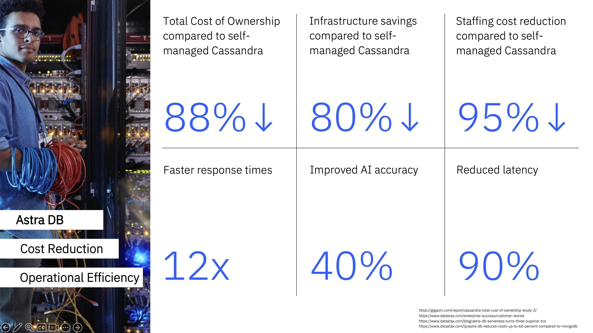

# Modern Data Infrastructure with Astra DB through IaC

This repository contains examples to:
1. Set up and manage an Astra Database by the use of Terraform (this [README.md](./README.md))
2. Manage Capacity Groups and their databases (see [README-scaling.md](./README-scaling.md))

## Business Value: Astra vs Self-Managed Cassandra

### Why Choose DataStax Astra Over Self-Managed Cassandra?

DataStax Astra provides significant business advantages over self-managed Apache Cassandra deployments, backed by industry research and real-world implementations.



#### Cost Reduction & Operational Efficiency
- **95% reduction in operational overhead** compared to self-managed Cassandra deployments
- **88% lower total cost of ownership (TCO)** over 3 years according to [GigaOM Total Economic Impact study](https://gigaom.com/report/cassandra-total-cost-of-ownership-study-2/)
- **95% reduction in database administration time** - from weeks to hours for routine operations
- **Zero infrastructure management** - no need for dedicated DevOps resources for database operations

#### Performance & Reliability
- **99.99% uptime SLA** with automatic failover and multi-region replication
- **Sub-millisecond latency** with global edge deployment
- **Auto-scaling capabilities** that respond to traffic patterns in real-time
- **Built-in monitoring and alerting** with comprehensive observability

#### Developer Productivity
- **Faster time-to-market** with APIs and languages your developers already know and love
- **Instant provisioning** - databases ready in minutes vs weeks for self-managed
- **Serverless architecture** - pay only for what you use with automatic scaling
- **Built-in security** with encryption at rest and in transit, VPC integration, and IAM

#### Business Impact
- **Faster development cycles** for data-intensive applications
- **Scaling up and down** according to business needs, lowering cost dramatically
- **Enterprise-grade security** with SOC 2 Type II compliance, PCI, SOC2, HIPAA, ISO 27001 and GDPR readiness
- **Global scale** with 25+ regions across AWS, GCP, and Azure

### Research & Case Studies
- [Total Cost of Ownership Study](https://gigaom.com/report/cassandra-total-cost-of-ownership-study-2/) - 88% TCO reduction, 95% operational overhead reduction
- [Astra Serverless turns Three](https://www.datastax.com/blog/astra-db-serverless-turns-three-superior-tco) - 9x higher throughput, 74x faster p99 query response, 20% higher F1 score
- [Astra DB reduces cost up to 60% compared to MongoDB](https://www.datastax.com/lp/astra-db-reduces-costs-up-to-60-percent-compared-to-mongodb) - 60% less expensive to operate, staffing reductions up to 95%, infrastructure savings up to 80%
- [Customer Success Stories](https://www.datastax.com/customers) - Real-world implementations and ROI metrics

### When to Choose Astra
- **Startups to Enterprise**: From MVPs to mission-critical applications
- **When customer experience matters**: Every millisecond counts for real-time apps
- **Global Applications**: Multi-region deployments with low latency requirements
- **Compliance Needs**: SOC 2, GDPR, HIPAA, and other regulatory requirements
- **Resource Constraints**: Limited DevOps resources or expertise
- **Automatic Scaling**: Applications with unpredictable or seasonal traffic patterns

## Additional Value: Infrastructure as Code

### Why Use Terraform with DataStax Astra?

Combining Terraform with DataStax Astra provides exponential value through Infrastructure as Code (IaC) best practices, backed by industry research:

#### Infrastructure as Code Benefits
- **65% of executives report productivity boost** when using automation technologies according to [IBM Institute for Business](https://www.ibm.com/think/topics/infrastructure-as-code)
- **80% of enterprises are not gaining cloud ROI** due to complexity according to [Hashicorp](https://www.hashicorp.com/en/on-demand/infrastructure-cloud-whitepaper)
- **20% increase in operational efficiency** according to Havard Business Review
- **15% reduction in security incidents** according to Forrester

#### Operational Excellence
- **Version-controlled infrastructure** - track all changes with full audit trail
- **Automated compliance** - ensure infrastructure meets security and governance standards
- **Disaster recovery** - infrastructure can be recreated in minutes, not hours
- **Multi-environment management** - consistent deployments across all environments

#### Developer & DevOps Productivity
- **50% reduction in time spent on infrastructure tasks** according to [Puppet State of DevOps Report](https://puppet.com/resources/report/2021-state-of-devops-report/)
- **3x faster onboarding** of new team members with documented, versioned infrastructure
- **80% reduction in "works on my machine" issues** through environment consistency
- **Automated testing** of infrastructure changes before production deployment

#### Cost & Risk Management
- **40% reduction in infrastructure costs** through better resource utilization and automated scaling
- **70% reduction in security vulnerabilities** through automated security scanning and compliance checks
- **95% reduction in manual errors** that lead to production incidents
- **Automated cost optimization** with resource tagging and lifecycle management

### Research & Industry Data
- [HashiCorp State of Cloud Strategy Survey](https://www.hashicorp.com/en/state-of-the-cloud) - 75% faster deployments, 40% cost reduction
- [Puppet State of DevOps Report](https://puppet.com/resources/report/2021-state-of-devops-report/) - 50% reduction in infrastructure tasks, 3x faster onboarding
- [Gartner Infrastructure as Code Market Guide](https://www.gartner.com/en/research/methodologies/magic-quadrants-research) - IaC adoption reduces deployment time by 60-80%

### Terraform + Astra Synergies
- **Declarative Database Management**: Define database requirements in code, not clicks
- **Environment Parity**: Identical database configurations across all environments
- **Automated Scaling**: Infrastructure scales with application needs automatically
- **Compliance as Code**: Security and governance policies enforced through code
- **Disaster Recovery**: Complete infrastructure recreation in minutes
- **Team Collaboration**: Infrastructure changes through pull requests and code reviews

## Prerequisites

1. **Terraform**: Install Terraform version 1.0 or later
2. **Astra Account**: You need a DataStax Astra account
3. **API Token**: Generate an API token from your Astra account

## Setup

This Terraform configuration sets up a DataStax Astra database through Infrastucture as Code.

1. **Clone or download this configuration**

2. **Configure your variables**:
   ```bash
   cp terraform.tfvars.example terraform.tfvars
   ```
   Edit `terraform.tfvars` and set your values:
   - `database_name`: Name for your database
   - `keyspace_name`: Name for your keyspace
   - `cloud_provider`: AWS, GCP, or AZURE
   - `regions`: List of regions (e.g., ["us-east-1"])

3. **Set up your API token**:
   - Set the `ASTRA_API_TOKEN` environment variable:
     ```bash
     export ASTRA_API_TOKEN="your-api-token-here"
     ```
     Ideally this would be done using HashiCorp Vault.

## Usage

1. **Initialize Terraform**:
   ```bash
   terraform init
   ```

2. **Plan the deployment**:
   ```bash
   terraform plan
   ```

3. **Apply the configuration**:
   ```bash
   terraform apply
   ```

4. **View outputs**:
   ```bash
   terraform output
   ```

## Configuration Details

### Database Configuration
- **Serverless Database**: Fully managed serverless Cassandra database
- **Multi-region**: Deploy across multiple cloud regions
- **Zero Management**: No infrastructure management required

### Supported Cloud Providers
- AWS
- GCP
- Azure

### Available Regions
The available regions depend on your chosen cloud provider. Common regions include:
- **AWS**: us-east-1, us-west-2, eu-west-1, etc.
- **GCP**: us-central1, europe-west1, etc.
- **Azure**: eastus, westus2, etc.

## Outputs

After successful deployment, Terraform will output:
- `database_id`: Unique identifier for your database
- `database_name`: Name of the created database
- `database_status`: Current status of the database
- `database_regions`: Regions where the database is deployed
- `database_keyspace`: Name of the keyspace
- `database_cloud_provider`: Cloud provider used
- `database_organization_id`: Organization ID
- `database_cqlsh_url`: CQL shell URL for connecting to the database
- `database_data_endpoint_url`: Data endpoint URL for application connections
- `database_grafana_url`: Grafana URL for monitoring
- `database_graphql_url`: GraphQL URL for the database

Example:
```json
database_cloud_provider = "AWS"
database_cqlsh_url = "https://xyz-b7af-489a-83b2-99b114edfc8e-us-east-1.apps.astra.datastax.com/cqlsh"
database_data_endpoint_url = "https://xyz-b7af-489a-83b2-99b114edfc8e-us-east-1.apps.astra.datastax.com/api/rest"
database_grafana_url = "https://xyz-b7af-489a-83b2-99b114edfc8e-us-east-1.dashboard.astra.datastax.com/d/cloud/dse-cluster-condensed?refresh=30s&orgId=1&kiosk=tv"
database_graphql_url = "https://xyz-b7af-489a-83b2-99b114edfc8e-us-east-1.apps.astra.datastax.com/api/graphql"
database_id = "xyz-b7af-489a-83b2-99b114edfc8e"
database_keyspace = "mykeyspace"
database_name = "my-astra-db"
database_organization_id = "xyz-9d65-430a-bf68-3778e99f8a6c"
database_regions = tolist([
  "us-east-1",
])
database_status = "ACTIVE"
```

## Cleanup

To destroy the resources:
```bash
terraform destroy
```

## Troubleshooting

1. **Authentication Issues**: Ensure your API token is valid and has the necessary permissions
2. **Region Issues**: Verify the region is available for your chosen cloud provider
3. **Resource Limits**: Check if you have available capacity in your Astra organization

## Additional Resources

### DataStax Astra Documentation
- [DataStax Astra Documentation](https://docs.datastax.com/en/astra/)
- [Astra API Documentation](https://docs.datastax.com/en/astra/docs/api-reference.html)
- [Astra Database Management](https://docs.datastax.com/en/astra/docs/manage-databases.html)
- [Astra Security and Access Control](https://docs.datastax.com/en/astra/docs/security.html)

### Terraform Provider Documentation
- [Terraform Astra Provider Documentation](https://registry.terraform.io/providers/datastax/astra/latest/docs)
- [Terraform Astra Provider GitHub Repository](https://github.com/datastax/terraform-provider-astra)
- [Terraform Astra Provider Examples](https://github.com/datastax/terraform-provider-astra/tree/main/examples)

### Terraform Resources Reference
- [astra_database Resource](https://registry.terraform.io/providers/datastax/astra/latest/docs/resources/database)
- [astra_token Resource](https://registry.terraform.io/providers/datastax/astra/latest/docs/resources/token)
- [astra_keyspace Resource](https://registry.terraform.io/providers/datastax/astra/latest/docs/resources/keyspace)
- [astra_table Resource](https://registry.terraform.io/providers/datastax/astra/latest/docs/resources/table)

### Getting Started Guides
- [Terraform Getting Started Guide](https://learn.hashicorp.com/terraform)
- [DataStax Astra Getting Started](https://docs.datastax.com/en/astra/docs/getting-started.html)
- [Astra Database Quickstart](https://docs.datastax.com/en/astra/docs/quickstart.html)
